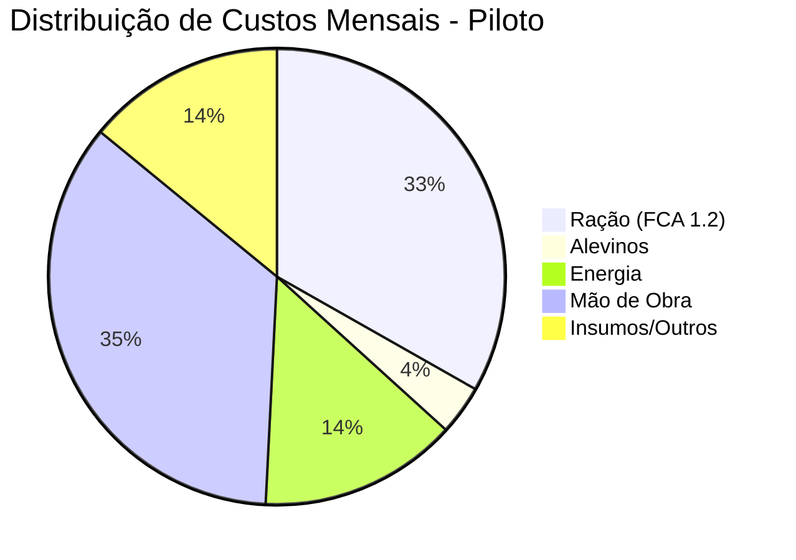

# 10. OPEX Detalhado (Custos Operacionais)

Este documento detalha os custos operacionais recorrentes para as duas escalas de produção do projeto Opala Aquaponia.

## 1. OPEX - Fase Piloto (30m³ Total)
Baseado em 175 kg vivos despescados por mês.

| Item | Frequência | Custo Mensal (R$) | Custo Anual (R$) |
| :--- | :--- | :--- | :--- |
| **Ração (FCA 1.2)** | 210 kg/mês | 945,00 | 11.340,00 |
| **Alevinos (Vacinados)** | 250 un/mês | 100,00 | 1.200,00 |
| **Energia Elétrica** | Estimado | 400,00 | 4.800,00 |
| **Mão de Obra** | Própria/Part-time | 1.000,00 | 12.000,00 |
| **Insumos (Probióticos/Sal)** | Recorrente | 200,00 | 2.400,00 |
| **Manutenção/Trocas** | Limpeza/Consertos | 100,00 | 1.200,00 |
| **Embalagem/Gelo** | Pós-produção | 100,00 | 1.200,00 |
| **TOTAL OPEX** | | **2.845,00** | **34.140,00** |

---

## 2. OPEX - Meta Industrial (360m³ Total)
Baseado em 2.100 kg vivos despescados por mês (venda de filé premium).

| Item | Frequência | Custo Mensal (R$) | Custo Anual (R$) |
| :--- | :--- | :--- | :--- |
| **Ração Comercial*** | 2.520 kg/mês | 11.340,00 | 136.080,00 |
| **Alevinos (Genética)** | 3.000 un/mês | 1.200,00 | 14.400,00 |
| **Energia (Climatização)** | Industrial | 2.800,00 | 33.600,00 |
| **Mão de Obra (Técnico)** | 1 Funcionário | 4.000,00 | 48.000,00 |
| **Processamento (Terceiro)** | Abate/Filetagem | 2.000,00 | 24.000,00 |
| **Manutenção Automação** | Calibração/Peças | 800,00 | 9.600,00 |
| **Logística/Frete** | Distribuição | 1.500,00 | 18.000,00 |
| **Marketing/Vendas** | Embalagens Vácuo | 1.000,00 | 12.000,00 |
| **TOTAL OPEX** | | **24.640,00** | **295.680,00** |

## Impacto da Automação e Redução de Custos
*No cenário Industrial, a produção própria de ração (Fase 5) reduz o custo operacional de ração em aproximadamente 50%.*

- **Custo Ração Comercial Anual**: R$ 136.080
- **Custo Ração Própria (Estimado)**: R$ 68.040
- **Margem de Ganho Extra**: **R$ 68.040 / ano** apenas na alimentação.

## Ponto de Equilíbrio (Break-Even)
- **Piloto**: O custo fixo é coberto a partir da venda de ≈ 57 kg de filé/mês.
- **Industrial**: O custo fixo é coberto a partir da venda de ≈ 410 kg de filé/mês (sem considerar a produção de ração própria).
