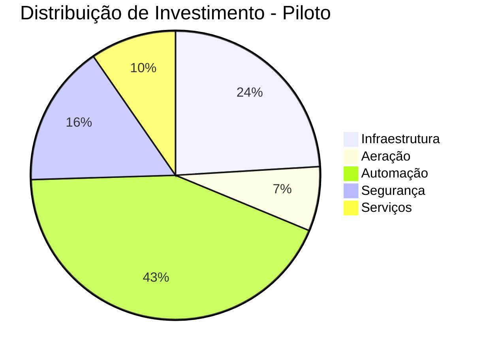
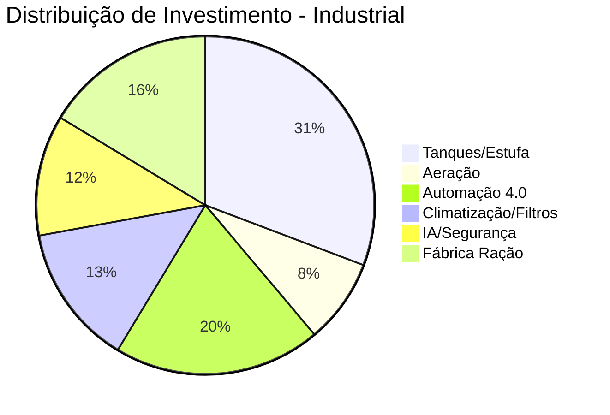

# 9. CAPEX Detalhado (Investimentos)

Este documento detalha os investimentos de capital (CAPEX) necessários para as duas escalas do projeto Opala Aquaponia.

## 1. CAPEX - Fase Piloto (6 x 5.000L)
Investimento focado em validar o modelo com baixo risco e automação modular.

| Categoria | Item | Qtd | Valor Est. (R$) |
| :--- | :--- | :---: | :--- |
| **Infraestrutura** | Tanques Circulares (Lona/Arame) | 6 | 15.000 |
| **Infraestrutura** | Instalação Hidráulica e Registros | 1 | 5.000 |
| **Infraestrutura** | Proteção (Telas/Mantas) | 1 | 5.000 |
| **Aeração** | Sopradores Laterais (1.0 CV) | 2 | 5.000 |
| **Aeração** | Mangueiras Aero-Tube e Conectores | 1 | 2.500 |
| **Automação** | Controlador (ESP32/CLP de entrada) | 1 | 8.000 |
| **Automação** | Sensores de Oxigênio (OD) | 6 | 18.000 |
| **Automação** | Sensores pH e Temperatura | 6 | 4.000 |
| **Automação** | Válvulas Solenoide e Inversores | 1 | 15.000 |
| **Segurança** | Nobreak (UPS) Dupla Conversão | 1 | 4.500 |
| **Segurança** | Gerador Pequeno (Gasolina/QTA) | 1 | 12.000 |
| **Serviços** | Montagem e Configuração do Sistema | 1 | 10.000 |
| **INVESTIMENTO TOTAL** | | | **R$ 104.000** |

---

## 2. CAPEX - Meta Industrial (6 x 60.000L)
Investimento industrial completo para escala de despescas de 2,1 toneladas/mês.

| Categoria | Item | Qtd | Valor Est. (R$) |
| :--- | :--- | :---: | :--- |
| **Tanques** | Tanques de Concreto ou Estrutura Metálica | 6 | 100.000 |
| **Tanques** | Estufa Agrícola / Galpão | 1 | 60.000 |
| **Aeração** | Sopradores Industriais (2.0 CV) | 4 | 22.000 |
| **Aeração** | Sistema de Difusão de Membranas EPDM | 1 | 12.000 |
| **Aeração** | Rede Ring Main PVC de Alta Pressão | 1 | 8.000 |
| **Automação 4.0** | Central CLP Siemens / Inversores | 1 | 40.000 |
| **Automação 4.0** | Sensores Ópticos RDO (OD) | 6 | 30.000 |
| **Automação 4.0** | Sistema de Amostragem ISE (Amônia) | 1 | 18.000 |
| **Automação 4.0** | Solenoides e Atuadores Industriais | 1 | 15.000 |
| **Climatização** | Bomba de Calor Industrial (300k+ BTU) | 1 | 45.000 |
| **Resíduos** | Filtro de Tambor (Drum Filter) | 1 | 25.000 |
| **IA / Visão** | Câmeras IP e Servidor de IA | 1 | 20.000 |
| **Segurança** | Gerador Diesel 20kVA com QTA | 1 | 40.000 |
| **Fábrica Ração** | Extrusora e Silagem Estabilizada | 1 | 85.000 |
| **INVESTIMENTO TOTAL** | | | **R$ 520.000** |

## Observações
- Os valores da Meta Industrial excedem os R$ 400 mil iniciais devido à inclusão da **Fábrica de Ração** e **Filtros de Tambor**, que são essenciais para atingir o FCA de 0.8:1 e gestão de resíduos zero.
- A Fase Piloto pode ser simplificada removendo o Gerador no início caso a rede local seja estável, reduzindo o custo inicial para ~R$ 90 mil.
